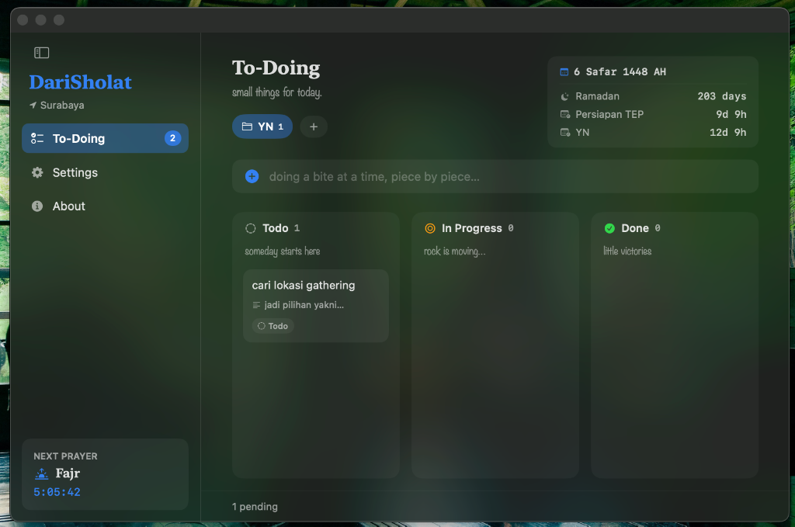
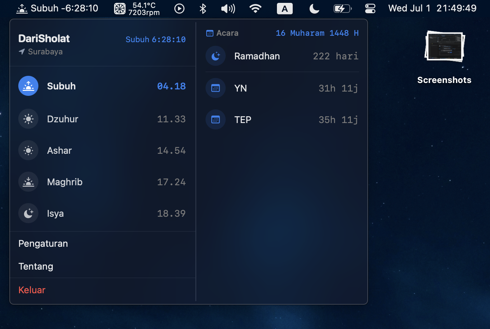
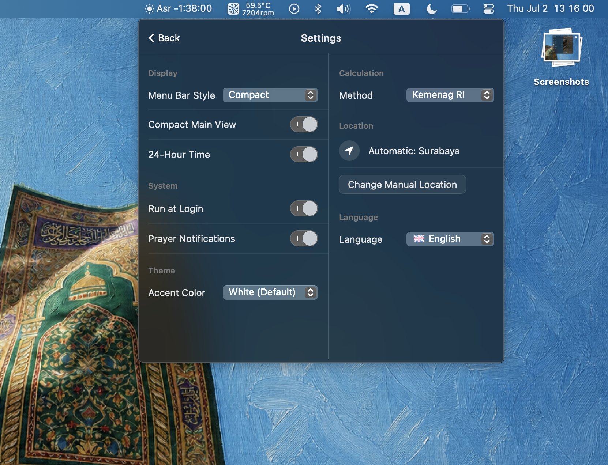
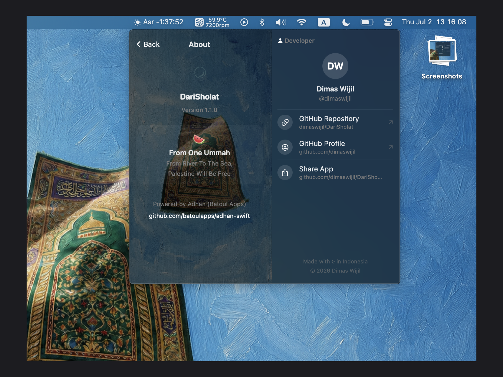

# DariSholat 🕋

> Aplikasi menu bar macOS yang ringan dan elegan untuk memantau waktu sholat harian langsung dari desktop kamu.

<p align="center">
  
</p>

<p align="center">
  
  
  
  
  
</p>

<p align="center">
  
  
  
  
  
  
  
  
  
</p>

---

## Fitur Utama

| Fitur | Deskripsi |
|---|---|
| 📍 **Lokasi Otomatis** | Mendeteksi kota secara otomatis dan menampilkan waktu sholat berdasarkan koordinat GPS |
| ⏳ **Hitung Mundur Real-time** | Countdown di menu bar memperlihatkan sisa waktu menuju sholat berikutnya secara langsung (contoh: `Fajr -40:32`) |
| 📅 **Integrasi Kalender (Events)** | Menyinkronkan jadwal sholat dengan acara/event di kalender bawaan Mac (iCloud Calendar) Anda |
| 🌍 **Multi-Bahasa (9 Bahasa)** | Mendukung bahasa Indonesia, English, Arabic, Turkish, Japanese, Kazakh, Persian, Urdu, dan Malay secara native |
| 🎨 **Personalisasi Tema & UI** | Sesuaikan warna aksen (Accent Color) aplikasi sesuai selera, dengan dukungan penuh mode gelap/terang native macOS |
| 🕒 **Jadwal Lengkap** | Menampilkan semua waktu sholat: Subuh, Syuruq, Dzuhur, Ashar, Maghrib, dan Isya |
| ⚙️ **Metode Kemenag RI & Global** | Menggunakan metode perhitungan dari Kementerian Agama Republik Indonesia maupun standar global lainnya |
| 🔔 **Notifikasi Sholat** | Pengingat otomatis saat waktu sholat tiba agar tidak terlewat saat sedang bekerja |
| ✅ **To-Doing (Kanban Board)** | Kelola tugas harian dengan papan kanban (Todo → In Progress → Done), lengkap dengan kategori project, kalender Hijriah, dan countdown sholat berikutnya |

---

## Tampilan Aplikasi

<p align="center">
  
</p>
<p align="center"><em>To-Doing — Papan kanban untuk mengelola tugas harian dengan kalender Hijriah dan countdown sholat</em></p>

<p align="center">
  
</p>
<p align="center"><em>Tampilan utama — Jadwal sholat dengan countdown real-time dan kalender Hijriah</em></p>

<p align="center">
  
</p>
<p align="center"><em>Halaman pengaturan — Display, tema, metode perhitungan, lokasi, dan bahasa</em></p>

<p align="center">
  
</p>
<p align="center"><em>Halaman tentang — Informasi developer dan link repositori</em></p>

---

## ⚙️ Pengaturan yang Tersedia

- **Display:** Menu Bar Style (Icon Only / Compact) dan format waktu 24 jam.
- **System:** Opsi jalankan saat login (Run at Login) dan Notifikasi waktu sholat.
- **Theme:** Penyesuaian warna aksen aplikasi (Accent Color) dengan palet atau warna kustom.
- **Calculation:** Berbagai pilihan metode perhitungan waktu sholat (Kemenag RI, MWL, ISNA, dll).
- **Location:** Lokasi otomatis (berbasis koordinat) atau perubahan lokasi manual.
- **Language:** Pilihan multibahasa untuk antarmuka aplikasi.

---

## 🛠️ Teknologi

- **Bahasa:** Swift
- **Framework:** SwiftUI / AppKit
- **Platform:** macOS 13.0+ (Ventura atau lebih baru)
- **Dependency:** [adhan-swift](https://github.com/batoulapps/adhan-swift) oleh Batoul Apps — library open-source yang teruji untuk perhitungan waktu sholat

---

## 🚀 Cara Install (Untuk Pengguna / User)

Jika Anda hanya ingin menggunakan aplikasi tanpa harus berurusan dengan *coding* atau Xcode, Anda bisa langsung mengunduh aplikasinya:

1. Pergi ke halaman **[Releases](../../releases/latest)** di repositori ini.
2. Unduh file **`DariSholat-1.0.0.dmg`** (atau versi terbaru).
3. Setelah selesai, buka file `.dmg` tersebut.
4. **Drag & Drop** (seret dan lepas) ikon aplikasi **DariSholat** ke folder **Applications**.
5. Buka Launchpad atau Spotlight (`Cmd + Space`), lalu cari **DariSholat** dan jalankan.
6. Saat pertama kali dibuka, berikan izin lokasi agar aplikasi bisa menentukan waktu sholat yang tepat untuk kota Anda.
7. Aplikasi akan muncul di **Menu Bar** (pojok kanan atas layar) dengan ikon 🌙.

---

## 💻 Cara Build Lokal (Untuk Developer)

Ikuti langkah-langkah berikut untuk build dan menjalankan aplikasi di Mac kamu:

### Prasyarat

- macOS 13.0 (Ventura) atau lebih baru
- Xcode 14 atau lebih baru
- Koneksi internet (untuk mengunduh dependency saat pertama kali)

### Langkah-langkah

**1. Clone repository**

```bash
git clone https://github.com/dimaswijil/darisholat-mac.git
cd darisholat-mac
```

**2. Buka di Xcode**

```bash
open DariSholat.xcodeproj
```

> Jika menggunakan Swift Package Manager workspace, buka file `.xcworkspace`.

**3. Resolve dependencies**

Xcode akan otomatis mengunduh dependency `adhan-swift` melalui Swift Package Manager. Tunggu hingga proses selesai (ditandai dengan hilangnya loading di status bar Xcode).

**4. Build dan jalankan**

Tekan `⌘R` atau klik tombol **Run** di Xcode. Setelah berhasil, ikon DariSholat akan muncul di menu bar macOS kamu.

---

## 📁 Struktur Proyek

```
DariSholat/
├── DariSholat/
│   ├── App/                  # Entry point aplikasi (DariSholatApp.swift)
│   ├── Views/                # Komponen tampilan SwiftUI
│   │   ├── MainWindow/       # To-Doing kanban board (MainWindowView, TodoListView, CommandPaletteView)
│   │   ├── ContentView.swift
│   │   ├── SettingsView.swift
│   │   ├── AboutView.swift
│   │   └── VisualEffectView.swift
│   ├── ViewModels/           # ViewModel (PrayerTimeViewModel)
│   ├── Managers/             # Manager (LocationManager, NotificationManager, CalendarManager, TodoManager, MainWindowManager)
│   ├── Utils/                # Utility (Localization)
│   └── Resources/            # Assets.xcassets, Info.plist, Entitlements
├── DariSholatUITests/        # UI Tests
├── .github/workflows/        # GitHub Actions CI
├── DariSholat.xcodeproj/
└── README.md
```

---

## 🤝 Kontribusi

Kontribusi sangat disambut! Berikut cara berkontribusi:

1. **Fork** repository ini
2. Buat branch baru: `git checkout -b fitur/nama-fitur`
3. Commit perubahan: `git commit -m 'Menambahkan fitur X'`
4. Push ke branch: `git push origin fitur/nama-fitur`
5. Buat **Pull Request**

Untuk perubahan besar atau fitur baru, disarankan membuka **Issue** terlebih dahulu untuk mendiskusikan arah perubahan.

---

## Kredit 🙏

- Perhitungan waktu sholat menggunakan [adhan-swift](https://github.com/batoulapps/adhan-swift) oleh **Batoul Apps**
- Metode perhitungan default mengacu pada standar **Kementerian Agama Republik Indonesia (Kemenag RI)**

---

<p align="center">
  Dibuat dengan ♥ untuk Muslim Global 🌎
  <br>
  🍉 Free Palestine, From Fiver To The Sea
</p>
