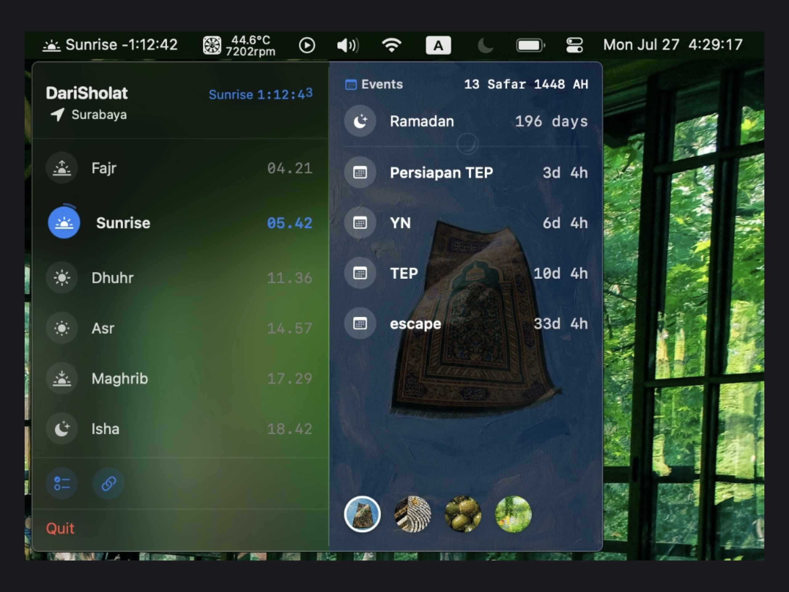

# DariSholat 🕋

> Aplikasi menu bar macOS yang ringan dan elegan: waktu sholat, kalender Hijriah, dan papan tugas To-Doing — langsung dari desktop kamu.

<p align="center">
  
</p>

<p align="center">
  
  
  
  
</p>

---

## Daftar Isi

- [Fitur Utama](#fitur-utama)
- [Tampilan](#tampilan)
- [Instalasi](#instalasi)
- [Dokumentasi](#dokumentasi)
- [Kontribusi](#kontribusi)
- [Kredit](#kredit)

---

## Fitur Utama

| Fitur | Deskripsi |
|---|---|
| 🕒 **Jadwal Sholat Lengkap** | Subuh, Syuruq, Dzuhur, Ashar, Maghrib, Isya — dengan countdown real-time di menu bar (`Fajr -40:32`) |
| 📍 **Lokasi Otomatis / Manual** | Deteksi GPS otomatis, atau pilih manual dari 18 kota besar Indonesia |
| ✅ **To-Doing (Kanban Board)** | Papan tugas Todo → In Progress → Done dengan folder, drag & drop, catatan ala Notion, dan quote harian |
| 🌙 **Wake from Sleep** | Window To-Doing otomatis tampil saat Mac bangun dari sleep — mulai hari dengan rencana |
| 📅 **Kalender Apple + Hijriah** | Countdown ke semua event kalender dan tanggal Hijriah hari ini |
| 🔔 **Notifikasi Sholat** | Pengingat otomatis saat waktu sholat tiba |
| 🌍 **9 Bahasa** | Indonesia, English, العربية, Türkçe, 日本語, Қазақша, فارسی, اردو, Melayu |
| 🎨 **Tema & Aksen** | Warna aksen kustom, wallpaper pilihan, blur ala Control Center |
| ⚙️ **Metode Perhitungan** | Kemenag RI (default), MWL, ISNA, dan standar global lainnya |

---

## Tampilan

| | |
|---|---|
|  |  |
| *Popover menu bar — jadwal sholat & events* | *Beranda — wallpaper & countdown events* |
|  |  |
| *To-Doing — papan kanban & rundown acara* | *Pengaturan — tema, metode & lokasi* |

---

## Instalasi

### Untuk Pengguna

1. Unduh `.dmg` terbaru dari halaman **[Releases](../../releases/latest)**
2. Buka file `.dmg`, lalu **drag & drop** DariSholat ke folder **Applications**
3. Jalankan dari Launchpad / Spotlight — ikon 🌙 muncul di menu bar
4. Izinkan akses lokasi saat diminta agar jadwal sholat akurat

### Untuk Developer

```bash
git clone https://github.com/dimaswijil/DariSholat.git
cd DariSholat
open DariSholat.xcodeproj
```

Tekan `⌘R` — Xcode otomatis mengunduh dependency [adhan-swift](https://github.com/batoulapps/adhan-swift) via Swift Package Manager.

**Prasyarat:** macOS 13+ (Ventura), Xcode 14+.

Panduan lengkap: **[docs/DEVELOPMENT.md](docs/DEVELOPMENT.md)**

---

## Dokumentasi

| Dokumen | Isi |
|---|---|
| [docs/FEATURES.md](docs/FEATURES.md) | Panduan lengkap setiap fitur beserta cara pakainya |
| [docs/DEVELOPMENT.md](docs/DEVELOPMENT.md) | Setup development, arsitektur, struktur proyek, dan konvensi kode |
| [docs/CHANGELOG.md](docs/CHANGELOG.md) | Riwayat perubahan tiap versi |

---

## Kontribusi

Kontribusi sangat disambut!

1. **Fork** repository ini
2. Buat branch: `git checkout -b fitur/nama-fitur`
3. Commit: `git commit -m 'Menambahkan fitur X'`
4. Push dan buat **Pull Request**

Untuk perubahan besar, buka **Issue** dulu untuk diskusi. Baca [docs/DEVELOPMENT.md](docs/DEVELOPMENT.md) untuk konvensi kode (spacing Fibonacci/golden ratio, pola animasi, dll).

---

## Kredit

- Perhitungan waktu sholat: [adhan-swift](https://github.com/batoulapps/adhan-swift) oleh **Batoul Apps**
- Metode default: **Kementerian Agama Republik Indonesia (Kemenag RI)**

---

<p align="center">
  Dibuat dengan ♥ untuk Muslim Global 🌎
  <br>
  🍉 Free Palestine, From River To The Sea
</p>
